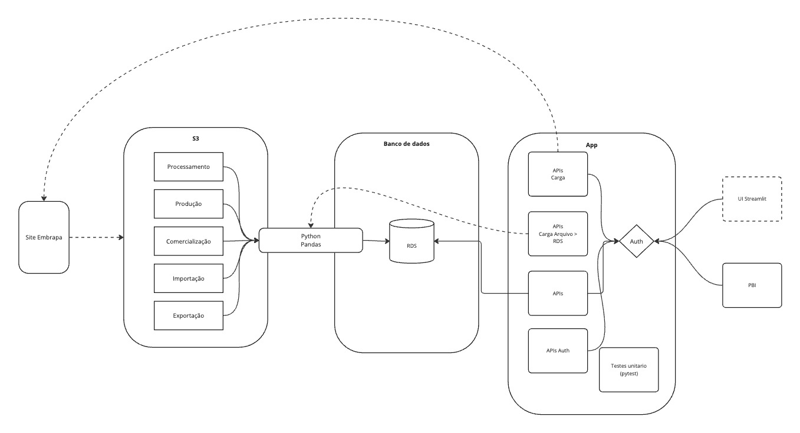

# FIAP - Tech Challenge 01

# Arquitetura


Board Miro: https://miro.com/app/board/uXjVL7Z2f4M=/?share_link_id=93685718113

# Infraestrutura

A infraestrutura é criada através do Terraform (disponível no diretório `tf`):

- Criar um cluster Aurora PostgreSQL
- Criar um bucket S3
- Criar uma tabela no banco de dados Aurora
- Criar uma instancia EC2 para execução da aplicação

# Scraping 

A aplicação scraping é responsável pela extração dos dados do site da Embrapa e armazenamento no BD. Os processos de carga serão agendados para execução periódica.

## Modelo de dados

O banco de dados que vai armazenar o dados será o Aurora PostgreSQL, da AWS.

Para cada tipo de dados será criada uma tabela. A gestão do modelo de dados é realizado pelo pacote `alembic`,

```bash
alembic init migrations

alembic revision --autogenerate -m "add tables"

alembic upgrade head
```


## Carga de dados.

Para extração dos dados do site e persistência em arquivo local, executar:

```bash
poetry run python scraping.py
```

Para ler os dados do arquivo e persistir no banco de dados, executar:

```bash
poetry run python scraping.py
```

# API

A aplicação Python será responsável por:

- Expor uma API registro de usuários
- Expor uma API geração de token do usuário
- Expor uma APIs para consulta dos dados por tipo e ano

```bash
poetry run uvicorn app.main:app --host 0.0.0.0 --port 8000
```

# Especificação API

A especificação da API está disponível em: http://52.87.237.166:8000/docs

# Analytics

Detalhamento das visões analíticas com PBI, pode ser acessado no link:

https://app.powerbi.com/view?r=eyJrIjoiMTVhNTEwNDUtYTk4Yy00ODJhLTljOTAtODY3N2QzODhmMTc3IiwidCI6ImE5ZWYzOTU5LThiOTYtNGVlMC05MjNjLTFkODlhZDk2OWNmOSJ9


