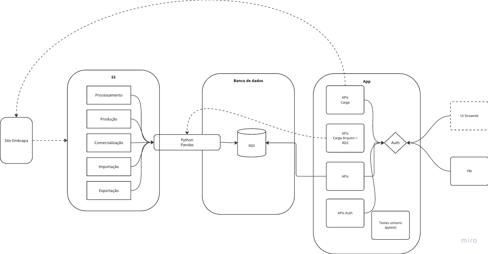

# FIAP - Tech Challenge 01

# Arquitetura


 

# Infraestrutura

A infraestrutura é criada através do Terraform (disponível no diretório `tf`):

- Criar um cluster Aurora PostgreSQL
- Criar um bucket S3
- Criar uma tabela no banco de dados Aurora
- Criar um container registry ECR
- Criar um ambiente de execução ECS

# Dados

## Modelo de dados

O banco de dados que vai armazenar o dados será o Aurora POstgreSQL, da AWS.

O modelo de dados é o seguinte:

- `production` - Tabela que vai armazenar os dados da produção

```sql
CREATE TABLE production (
    group_id VARCHAR(255) NOT NULL,
    group VARCHAR(255) NOT NULL,
    product_id VARCHAR(255) NOT NULL,
    product VARCHAR(255) NOT NULL,
    year INT NOT NULL
    qty FLOAT NOT NULL,
    PRIMARY KEY (group_id, product_id, year)
);
```

## Carga de dados.

Os seguintes arquivos serão carregados no S3:

TO-DO: Detalhar nomes dos arquivos

A carga de dados deverá utilizar o pandas para ler os arquivos disponíveis no S3 e gravar no banco de dados Aurora.

Formato original:
| id | control | cultivar | 1970 | 1971 | 1972 | 1973 |
|-------|----------------------------|-------------------------|----------|----------|---------|---------|
| 1 | TINTAS | TINTAS | 56976 | 43390 | 4428 | 8939 |
| 2 | ti* Alphonse Lavallee | Alphonse Lavallee | 31878 | 2333 | 170 | 7690 |
| 3 | ti* Moscato de Hamburgo | Moscato de Hamburgo | 25098 | 41057 | 4258 | 1249 |
| 4 | BRANCAS | BRANCAS | 3900 | 16335 | 6829 | 8052 |
| 5 | br_Cardinal | Cardinal | 0 | 0 | 0 | 0 |
| 6 | br_Golden Queen | Golden Queen | 167 | 8654 | 657 | 7312 |

- Agrupamento por grupo

O arquivo contém ainda linhas totalizadoras (como a TINTAS e BRANCAS), que devem ser ignoradas na carga. Estes itens devem ser adicionados a coluna `group` e `group_id`.

Para identificar os grupos, devemos verificar de a coluna control e cultivar forem iguais, então o grupo é o control e o group*id está no control da próxima linha. Selecionar do início do código até o primeiro underline. Ex: TINTAS -> `ti*`

- Transposição das linhas para colunas

Como os dados estão com os anos em colunas, devemos fazer a transposição das linhas para colunas.

Formato final:

| group_id | group   | product_id               | product             | qty   | year |
| -------- | ------- | ------------------------ | ------------------- | ----- | ---- |
| ti\_     | TINTAS  | ti\_ Alphonse Lavallee   | Alphonse Lavallee   | 31878 | 1971 |
| ti\_     | TINTAS  | ti\_ Moscato de Hamburgo | Moscato de Hamburgo | 25098 | 1972 |
| br\_     | BRANCAS | br_Cardinal              | Cardinal            | 0     | 1974 |
| br\_     | BRANCAS | br_Golden Queen          | Golden Queen        | 167   | 1975 |

# Aplicação

A aplicação Python será responsável por:

- Executar a leitura dos dados do S3 e gravar no banco de dados Aurora
- Expor uma APIs para consulta dos dados

```bash
poetry run python app/main.py
```

# Especificação API

A especificação da API está no arquivo `api_spec.yaml`

https://github.com/smatioli/fiap-tech-challenge-01
Ela pode ser visualizada no Swagger: https://editor.swagger.io/?url=https://raw.githubusercontent.com/smatioli/fiap-tech-challenge-01/main/api_spec.yaml

# Analytics

Detalhamento das visões analíticas com PBI

# Deployment

O deployment será feito através do GitHub Actions, que vai gerar o container Docker, publicar no ECR e atualizar o ambiente ECS.

