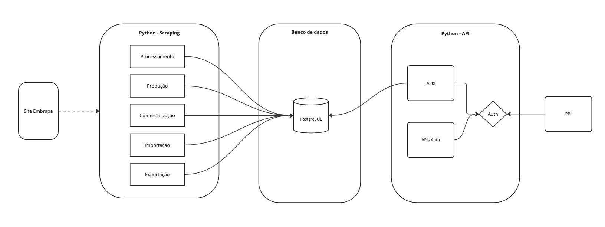

# FIAP - Tech Challenge 01

# Arquitetura



Para disponibilizar os dados da Embrapa através da API optamos por separar a aplicação em duas partes:

- Scraping: responsável pela extração dos dados do site da Embrapa e armazenamento no BD
- API: responsável pela exposição da API para consulta dos dados por tipo e ano

Esta separação se deve aos seguintes fatores:

- A extração dos dados é um processo que pode ser demorado, e não é necessário para que a API esteja disponível para consulta dos dados.
- O processo de scraping demanda libraries espcíficas e tem uma alta dependencia do chromium, que demanda gerenciamento e um ambiente isolado.
- A API deve ser altamente disponível, e não deve ser afetada por falhas no scraping.

Após a extração, os dados são persistidos localemente e num bucket S3. Em seguida são carregados para o banco de dados.

As APIs disponibilizzadas são:

- `/usuario/cadastrar`: para criação de usuários 
- `/usuario/login` para geração de token de acesso

Com o token gerado pelo login, o usuário pode acessar as seguintes APIs:

- `/producao/ano=YYYY` para consulta dos dados de produção por ano
- `/processamento/ano=YYYY&opcao=OPCAO` para consulta dos dados de processamento por ano
- `/comercializacao/ano=YYYY` para consulta dos dados de comercialização por ano
- `/importacao/ano=YYYY&opcao=OPCAO` para consulta dos dados de importação por ano
- `/exportacao/ano=YYYY&opcao=OPCAO` para consulta dos dados de exportação por ano
- `/consumo/ano=YYYY` para consulta dos dados de consumo por ano

A especificação da API está disponível em: http://<hostname>:8000/redoc

Para execução das requisições, utilize o arquivo `API_reqs_Insomnia.json`

# Infraestrutura

A infraestrutura é criada através do Terraform (disponível no diretório `tf`):

- Criação de um cluster e DB RDS PostgreSQL
- Criação de um bucket S3
- Criação de um EC2 para execução da aplicação

# Scraping 

A aplicação scraping é responsável pela extração dos dados do site da Embrapa e armazenamento no BD. Os processos de carga serão agendados para execução periódica.

## Modelo de dados

O banco de dados que vai armazenar o dados será o Aurora PostgreSQL, da AWS.

Para cada tipo de dados será criada uma tabela. A gestão do modelo de dados é realizado pelo pacote `alembic`,

```bash
alembic init migrations

alembic revision --autogenerate -m "add tables"

alembic upgrade head
```


## Carga de dados.

Para extração dos dados do site e persistência em arquivo local, executar:

```bash
poetry run python scraping.py
```

Para ler os dados do arquivo e persistir no banco de dados, executar:

```bash
poetry run python scraping.py
```

# API

A aplicação Python será responsável por:

- Expor uma API registro de usuários
- Expor uma API geração de token do usuário
- Expor uma APIs para consulta dos dados por tipo e ano

```bash
poetry run uvicorn app.main:app --host 0.0.0.0 --port 8000
```

# Especificação API

A especificação da API está disponível em: http://<hostname>:8000/redoc

# Analytics

Detalhamento das visões analíticas com PBI, pode ser acessado no link:

https://app.powerbi.com/view?r=eyJrIjoiMTVhNTEwNDUtYTk4Yy00ODJhLTljOTAtODY3N2QzODhmMTc3IiwidCI6ImE5ZWYzOTU5LThiOTYtNGVlMC05MjNjLTFkODlhZDk2OWNmOSJ9


